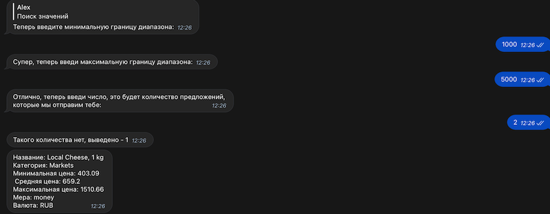

<h1 align="center">Телеграмм бот Мировые цены</h1>

---

# [Демонстрация](https://t.me/New_Lijia_bot)
___
### Описание бота
___
Телеграм бот реализован с помощью API [travel tables](http://traveltables.com), предназначен как помощник
для путешественников, чтобы быть в курсе цен в разных уголках Земли.
Бот реализован на языке программирования Python, с помощью библиотек 
[Aiogram 2](https://aiogram.dev), 
[requests](https://requests.readthedocs.io/en/latest/), 
[python-dotenv](https://github.com/theskumar/python-dotenv).

Это мой первый серьёзный проект, так что не ждите слишком многого от исходного кода :)

## Как пользоваться

---
### Начало!
Регистрируем своё местоположение в боте, после успешной регистрации, внизу появится 
клавиатура бота, это и будет наше меню:

### Максимальные или Минимальные цены
После нажатия этой кнопки вам предложат выбрать категорию:

После выбранной категории вам надо будет отправить боту количество предложений, 
которые ему надо вывести, после чего он сделает запрос на API сервер, и с учётом 
вашего местоположения, которое хранится в базе данных, выведет ответ на ваш запрос:

 ### Поиск значений

По сути это те же команды минимального и максимального значения, только вот диапазон цен 
пользователь теперь вводит сам:

### Изменить местоположение или узнать его

Если вам понадобится Изменить своё местоположение, то можете воспользоваться одноимённой 
кнопкой "Изменить местоположение", ничего сложного всё точно так же как и при начальной регистрации:

Если вы захотите узнать своё местоположение, то воспользуйтесь кнопкой "Моё местоположение":

 
___

## О проекте

Этот проект далеко не конечный продукт, хотелось бы многие функции объединить в класс, так же в проекте очень 
скудное логирование, да и код можно было бы местами упростить, возможно позже я займусь этим, но а 
пока я доволен результатом :)
___

## Установка
1. Скачать репозиторий.
2. Установить все доп. библиотеки из файла requirements.txt.
3. В файл .env вставить token бота, а так же ключ для API .
[(брать тут)](https://rapidapi.com/traveltables/api/cost-of-living-and-prices/https://rapidapi.com/traveltables/api/cost-of-living-and-prices/)
, или ключи если не хотите платить за API.
4. Запустить файл main.py
___
### Обратная связь
- ser.alex.serb@gmail.com